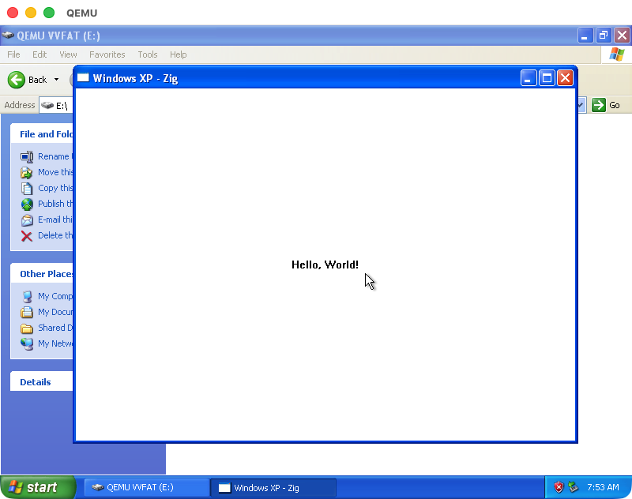

# Hello Zigwin

## Getting Started

This is a minimal Windows XP-compatible GUI application written in [Zig](https://ziglang.org). It creates a simple "Hello, World!" window using the Win32 API, cross-compiled from any platform using Zig's built-in cross-compilation capabilities.

### How to

#### Build the code

```sh
zig build
```

The resulting executable is located at `zig-out/bin/hello_zigwin.exe`.

#### Testing the executable

The executable targets Windows XP (NT 5.1) and later. You can test it using a Windows XP virtual machine with [QEMU](https://www.qemu.org/).

##### 1. Download a Windows XP ISO

You can find Windows XP Professional SP3 (x86) on the [Internet Archive](https://archive.org/details/WinXPProSP3x86).

##### 2. Create a virtual disk

```sh
qemu-img create -f qcow2 windows-xp.qcow2 4G
```

##### 3. Install Windows XP

```sh
qemu-system-i386 \
  -m 512 \
  -accel tcg \
  -cpu pentium3 \
  -vga cirrus \
  -hda windows-xp.qcow2 \
  -cdrom /path/to/windows_xp_sp3.iso \
  -boot d \
  -net nic,model=rtl8139 \
  -net user \
  -usb \
  -device usb-tablet \
  -display cocoa
```

##### 4. Boot and test the binary

After installation finishes, switch to booting from the hard drive and add a shared folder to transfer the binary:

```sh
qemu-system-i386 \
  -m 512 \
  -accel tcg \
  -cpu pentium3 \
  -vga cirrus \
  -hda windows-xp.qcow2 \
  -boot c \
  -net nic,model=rtl8139 \
  -net user \
  -usb \
  -device usb-tablet \
  -display cocoa \
  -drive file=fat:rw:zig-out/bin,format=raw,media=disk
```

The `zig-out/bin` directory (containing `hello_zigwin.exe`) will appear as a second drive inside the VM.


